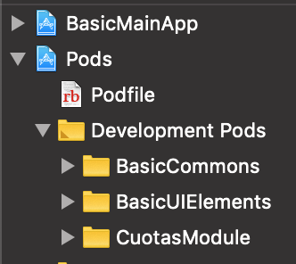
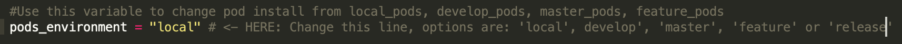
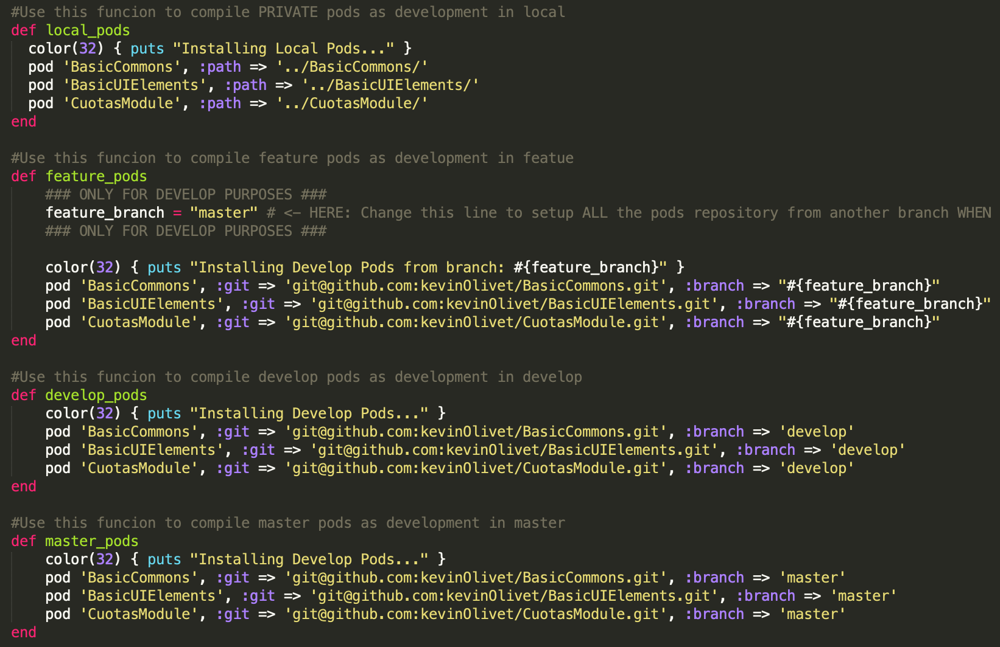
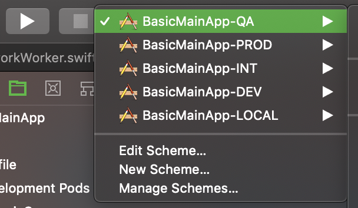
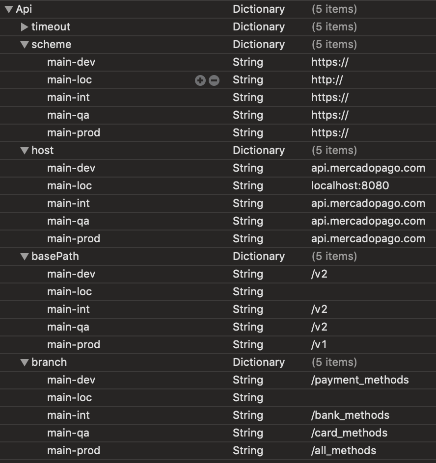
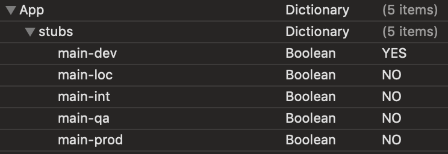
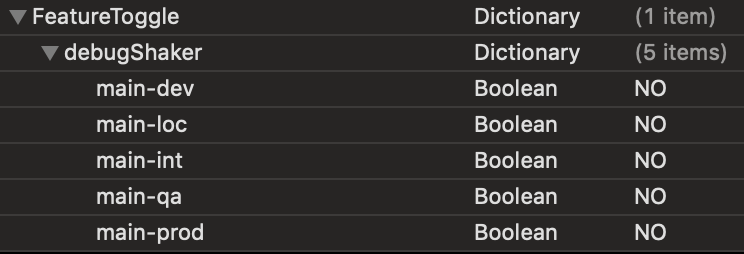

# BasicMainApp

This base project is found here: https://github.com/kevinOlivet/BasicMainApp/tree/feature-transbank

It is modified to serve as the base for a test module for Transbank consuming IMBD.

Simply switch to branch "feature-transbank" and run pod install.

Note:  The unit tests are with the individual modules.  

In this case, clone the repo here:

https://github.com/kevinOlivet/Transbank/tree/feature-transbank

install the pods and run the unit tests.

## Example

Clone the pod from here: https://github.com/kevinOlivet/BasicMainApp/tree/feature-transbank

and run `pod install` from the BasicMainApp directory first.

## Author

kevinOlivet, kevinolivet@yahoo.com

## License

This project is available under the MIT license. See the LICENSE file for more info.

## Features
BasicMainApp is the basic and public core project for a modular app.

Here are the outstanding features of BasicMainApp:

## Modularity:
The project is modular and extensible.  This is only the main part and it can easily add modules in the Podfile.  To avoid repetition and speed development, the common elements are collected in the BasicCommons module.  
For the same reasons, images and reusable UIElements are collected in the BasicUIElements module.
These three together represent the Core of the project.
As an example of what how a feature module would be integrated, currently the "CuotasModule" is implemented.

## Podfile:
The modules are installed via the podfile and the podfile is divided into different environments that correspond to branches in git.

For example: using the keyword "master" where indicated will install the master branches of the listed modules.
Using "develop" will do the same with the develop branches.
Use "feature" if a feature branches are currently active.

Using "local" will install files that already exist in the same folder and not the remote versions. I use this for faster development across modules if needed (new images to UIElements, Commons etc.)  
Note that this works best using the "Legacy Build System" found in the workplace settings.

## Enviroments:
The app can be run in different environments.  Currently the choices are: DEV, QA, INT, LOCAL and PROD. 

The environment choice defines what features are turned on or off in the app using the Configurations.plist
Most notable are the URL construction, stubs and FeatureToggle (explained below).

## URL construction
In a production level app, the urls will be different depending on the stage of development.  

For example a QA environment will be used for testing while the PROD will point to the live backend used by clients. 
DEV is a special case and and uses stubs (explained below).

## Stubs
Using the Configurations.plist by running in the DEV environment the actual url will not be called.  

Instead by using OHHTTPStubs the contents of a specified JSON file will be returned.  This allows for parallel development while the backend isn't ready or in case there are connectivity problems or just to be faster.

## FeatureToggle
The use of the FeatureToggle in the Configurations.plist combined with the choice of environment allows for certain features to be enabled or disabled easily.

=================================

BasicCommons and BasicUIElements are separate modules but are touched on below.

## BasicCommons
This module holds the common code to be used throughout the app.  It enforces standarization and reusability of code.
Some standardized elements are:
BaseViewController - allows quick configuration of new view controllers when they simply inherit from BaseViewController.  This comes with a default implementation (and customizable) loading view, error views for internet or service,  as well as a background gradient.
The network layer, add ons, extensions, encryption, etc are all centralized here.
This module is solely responsible for managing third party libraries.  
This example imports Alamofire, etc, but other modules in the project do not.  Any needed dependencies must pass through BasicCommons.

## BasicUIElements
This module serves a similar purpos to BasicCommons except that it holds the visual elements.
Assets, reusable nibs, buttons, colors, fonts are defined and standardized here.
This enforces the themes of the UI team.  For example, no team should come up with their own original color.  Swiftlint can show a compile time warning if they try.
